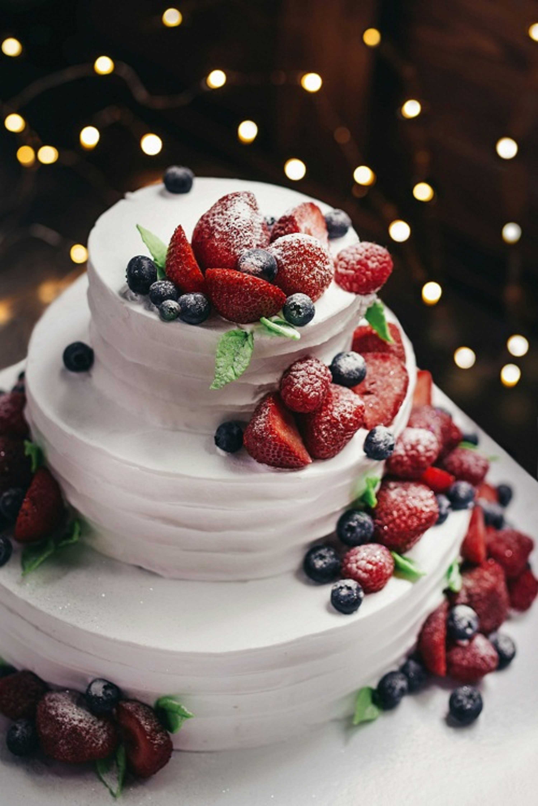

<!DOCTYPE html>
<html lang="en">
<head>
<meta charset="UTF-8">
<meta name="viewport" content="width=device-width, initial-scale=1.0">
<title>Sweet Cake Shop</title>

</head>

<body>

<header>
<h1> Sweet Cake Shop</h1>

Fresh Cakes | Birthday Cakes | Wedding Cakes

</header>

<nav>
<a href="#">Home</a>
<a href="#">About</a>
<a href="#">Gallery</a>
<a href="#">Menu</a>
<a href="#">Contact</a>
</nav>

<section class="hero">

<h2>Chocolate Cherry Layer Cake</h2>

A delicious three-layer chocolate cake topped with cherries,
chocolate ganache, whipped cream, and blueberry filling.
Perfect for birthdays, anniversaries, and special occasions.

<a href="#" class="btn">Order Now</a>

</section>

<section>

<h2>Why Choose Us?</h2>

<h3> Fresh Ingredients</h3>

Made daily using premium chocolate, fresh cream, and seasonal fruits.

<h3> Beautiful Decoration</h3>

Professionally decorated cakes for birthdays, weddings, and celebrations.

<h3> Fast Delivery</h3>

Same-day delivery available in selected locations.

</section>

<section style="background:white;">

<h2>Contact Us</h2>

Email: info@sweetcakeshop.com

Phone: 9284485735 

Open: Monday - Sunday | 9:00 AM - 9:00 PM

</section>

<footer>

© 2026 Sweet Cake Shop. All Rights Reserved.

</footer>

</body>
</html>
